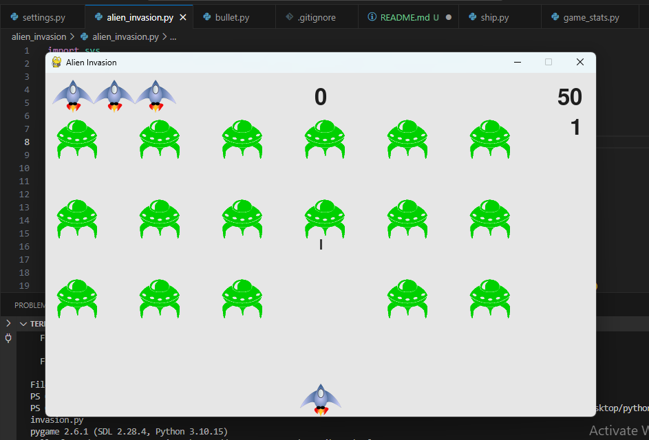

# Alien Invasion Game

This is a simple game developed using Python and Pygame. The goal is to shoot down the aliens before they reach the spaceship. 
The game is developed by reading the chapter 13 of Eric Matthes' book on Python (Python crash course).

## Features
- Player-controlled spaceship
- Alien waves increasing in difficulty
- Score tracking

## How to run this
- clone the repo
- Install pygame module
- run alien_invasion.py script.

# Alien Invasion Game

